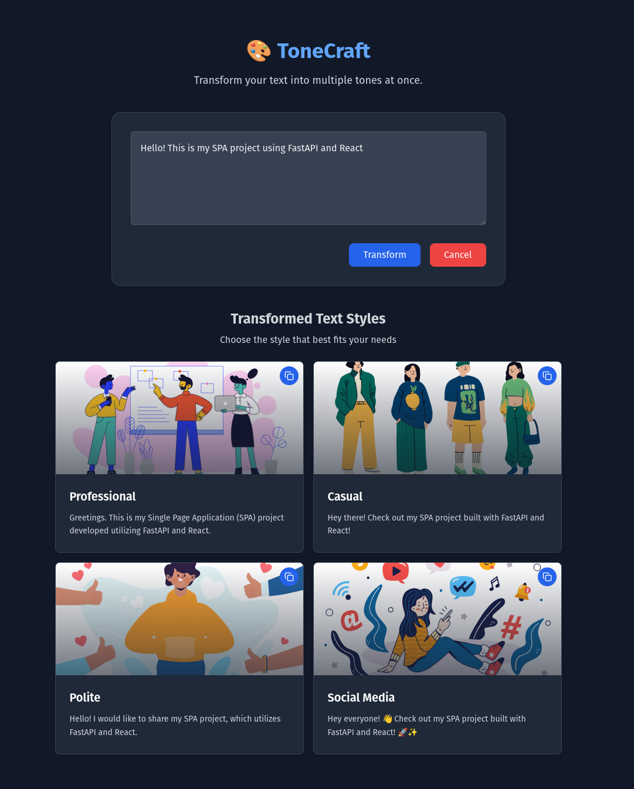

# 🎨 ToneCraft

**ToneCraft** is a SPA tool that transforms user-provided text into different communication styles—such as **professional**, **casual**, **polite**, and **social media** by using  large language models (LLMs). The project uses a **FastAPI** backend and a **React** frontend, with real-time **streaming responses** for better user interactivity.

---
## 🛠️ 1. Tech Stack

- FastAPI + Uvicorn (Python **3.11+**)
- OpenAI API (Async)
- React + Vite (Node.js **v20.x**)
- Streaming with `StreamingResponse`
- Vitest + Pytest 

---

## 🚀 2. Setup Instructions

Clone the repository:
   ```bash
   git clone git@github.com:bsgarciac/tone-craft.git
   ```

### 🔐 Environment Variables

To run ToneCraft locally, you need to first set up the backend environment variables.

1. Copy `.env.example` file inside the `backend` :
   ```bash
   cd tone-craft/backend
   mv .env.example .env
   ```
2. Add a valid OPENAI_API_KEY in .env file
   - This key is required to access the OpenAI API for text rewriting.
   - You can get your API key from [OpenAI's platform](https://platform.openai.com/account/api-keys).

### 🐳 Backend (FastAPI) with Docker

1. Build the Docker image:
   ```bash
   docker build -t tonecraft-backend .
   ```

2. Run the container with correct env file:
   ```bash
   docker run -d -p 8000:8000 --env-file .env tonecraft-backend
   ```

### 📦 Backend (FastAPI) No Docker

1. Create and activate a virtual environment:
   ```bash
   python -m venv venv
   source venv/bin/activate 
   ```

2. Install dependencies:
   ```bash
   pip install -r requirements.txt
   ```

3. Start the FastAPI development server:
   ```bash
   uvicorn app.main:app --reload
   ```

### 💻 Frontend (React + Vite)

1. Navigate to the frontend directory:
   ```bash
   cd ../frontend
   ```

2. Install and use the correct Node.js version (v20)

If you're using [nvm](https://github.com/nvm-sh/nvm), run:
   ```bash
   nvm use
   ```
3. Install frontend dependencies:
   ```bash
   npm install --legacy-peer-deps
   ```

4. Launch the frontend server:
   ```bash
   npm run dev
   ```
> The frontend expects the backend to run at `http://localhost:8000`. You can customize this with an `.env` file.

---

## 🧠 3. Design Decisions

### Async and Streaming
The backend utilizes **`asyncio`** to handle asynchronous, non-blocking operations. This architecture supports concurrent client connections and enables real-time token streaming.

### Integration with OpenAI
ToneCraft uses the official OpenAI SDK with `AsyncOpenAI` to send requests to language models. By setting `stream=True`, the API returns tokens incrementally, which are streamed directly to the frontend to enhance perceived speed and user experience.

### One API Call Per Style
ToneCraft performs a separate API call for each selected tone/style (e.g., professional, casual, polite, social media). While this increases usage and cost compared to generating all styles in a single request, it offers a true parallel streaming. The frontend can request and render each style independently, allowing users to see results as they come in, without waiting for all styles to complete.

This tradeoff prioritizes usability and quality over optimization, which aligns with ToneCraft's goal of providing a fast, expressive, and creative user experience.

---

## 🗂️ 4. Project Structure

### Backend (`/backend`)
```
backend/
├── app/
│   ├── main.py            # FastAPI entry point and route definitions
│   ├── services.py        # Wrappers for LLM API calls
│   ├── router.py          # Routes of the API
│   └── utils.py           # Utility functions
├── tests/                 
│   ├── integration/       # Unit tests
│   └── test/              # Integration tests
├── requirements.txt       # Python dependency file
├── Dockerfile             # Dockerfile for the image
└── .env.example           # Template for the expected env file
```

### Frontend (`/frontend`)
```
frontend/
├── src/                   
│   ├── assets/            # Static svg images
│   ├── components/        # Reusable React components
│   │   ├── __tests__/     # Frontend tests
│   │   └── ui/            # UI Components
│   ├── App.jsx            # Main app component
│   └── main.jsx           # Entry point for React rendering
├── public/                # Static assets
└── vite.config.js         # Vite configuration file
```

---

## ✅ 5. Testing Strategy

### Backend – `pytest`
- Located in `backend/tests/`
- Covers:
  - Endpoint functionality
  - Streaming behavior
  - Mocked interactions with external LLM APIs
- Run tests:
  ```bash
  pytest
  ```

### Frontend – `Vitest + @testing-library/react`
- Located in `frontend/__tests__/`
- Covers:
  - Component rendering
  - User input and tone selection
- Run tests:
  ```bash
  npm run test
  ```

---

## 🔮 6. Future Improvements and Extensions

1. **Redis Caching**  
   Use Redis to cache previously seen input-tone pairs to minimize redundant LLM API calls and reduce latency.

2. **Model-Driven Tone Configuration**  
   Abstract tone styles into database-configurable prompt templates, enabling dynamic tone creation and updates by admins.

3. **Authentication and Rate Limiting**  
   Add login support (JWT) and enforce per-user request limits for production-readiness.

---

## 🎥 Demo


## 🧾 License

MIT License © 2025 Brayan Garcia
